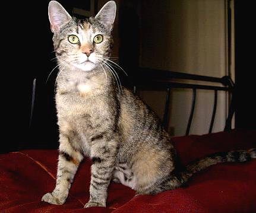

# DOG & CAT CLASSIFIER 

Clasificador de imágenes de perros y gatos utilizando técnicas de extracción de características y modelos de clasificación basados en aprendizaje automático.  

## Extractores de caracteristicas usados:

## Extractor 1 :
Este método de extracción de características consiste en:

1. Dividir la imagen en celdas tamaño NxN
2. Asignar a cada píxel vecino valores de 0 o 1 dependiendo de la intensidad
3. Usar los valores de los vecinos para hacer un número en binario y asignar ese color al pixel central
4. Una vez hecho eso con todos calculas un histograma por celda

#### Resultados: 
| Dataset         | Precision     |  Tiempo de ejecucución |
|--------------|-----------|------------|
| "cat_dog_100" | 95%     | 16.30 segundos       |
| "cat_dog_500"     | 92,5% | 4 minutos 26.28 segundos      |

## Extractor 2 :
Este método de extracción de características involucra tres pasos: 

1. Aplicar filtros de convolución para calcular la magnitud y orientación del gradiente.
2. Dividir la imagen en bloques disjuntos y crear histogramas para cada bloque 
3. Normalizar los histogramas. 

#### Resultados: 
| Dataset         | Precision     |  Tiempo de ejecucución |
|--------------|-----------|------------|
| "cat_dog_100" | 92,5%| 16.46 segundos       |
| "cat_dog_500"     | 90% | 1 minutos 27.68 segundos      |

## Clasificador usado:

SVM de Scikit-learn

https://scikit-learn.org/stable/modules/svm.html

---
# Videos explicativos:

## Video

## Video Codigo

---
Creado por Odei H. y Endika A.  2022-2023

